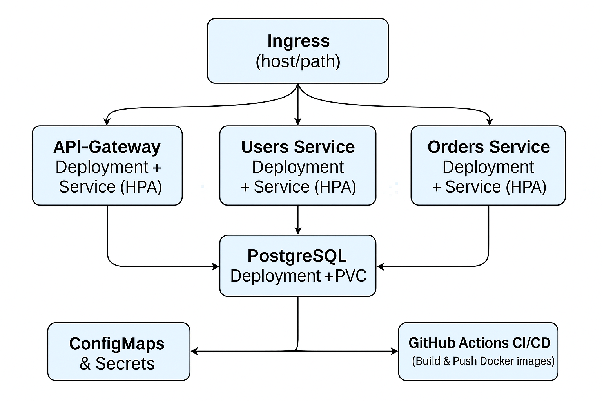

* Table of Contents :toc:
- [[#project-overview][Project Overview]]
  - [[#kubernetes-architecture-diagram][Kubernetes Architecture Diagram]]
  - [[#quick-prerequisite-checklist][Quick Prerequisite Checklist]]
  - [[#repository-layout][Repository Layout]]
- [[#create-and-deploy-kubernetes-cluster-locally][Create and deploy kubernetes cluster locally]]
  - [[#optional-manually-build-and-test-locally-minimal-microservices][(Optional) Manually build and test locally minimal microservices]]
  - [[#create-cluster][Create Cluster]]
  - [[#deploy-cluster][Deploy Cluster]]

* Project Overview
- 3 microservices (small, independent):
  + *api* — front-end API (Node.js / Express)
  + *users* — user service (CRUD, REST)
  + *orders* — order service (CRUD, REST)
- *Database*: PostgreSQL
- *Ingress*: HTTP routing with host/path rules
- *Config*: ConfigMaps & Secrets
- *Persistence*: PersistentVolumeClaim for Postgres
- *Deployment*: Deployments + Services + Horizontal Pod Autoscaler (HPA)
- *Packaging*: Helm chart for the app
- *Provisioning*: Full terraform infrastructure provisioning for Kubernetes
- *CI/CD*: GitHub Actions to install dependencies, build and push images to DockerHub using =workflow_dispatch=

** 
#+begin_src shell
                 ┌───────────────┐
                 │  Ingress      │
                 │ (host/path)   │
                 └──────┬────────┘
                        │
      ┌─────────────────┼─────────────────┐
      │                 │                 │
┌─────▼──────┐    ┌─────▼─────┐     ┌─────▼─────┐
│ API-Gateway│    │ Users Svc │     │ Orders Svc│
│ Deployment │    │ Deployment│     │ Deployment│
│ Service    │    │ Service   │     │ Service   │
└─────┬──────┘    └─────┬─────┘     └─────┬─────┘
      │                 │                 │
      └─────────────────┴─────────────────┘
                        │
                ┌───────▼────────┐
                │ PostgreSQL DB  │
                │ Deployment     │
                │ PVC / PV       │
                └────────────────┘

Additional:
- ConfigMaps & Secrets injected into Deployments
- HPA monitoring Deployments for scaling
- Docker images built & pushed via GitHub Actions CI/CD
#+end_src

** Quick Prerequisite Checklist
Install (locally):
- git
- docker
- kubectl
- minikube or kind
- helm (v3)
- terraform
  
** Repository Layout
#+begin_src shell
devops-k8s-project/
├─ README.org
├─ .github/
│  └─ workflows/
│     └─ ci-cd.yml
├─ charts/
│  └─ microservices/
│     ├── templates
│     │   ├── api-gateway.yaml
│     │   ├── hpa-orders.yaml
│     │   ├── hpa-users.yaml
│     │   ├── hpa-api.yaml
│     │   ├── ingress.yaml
│     │   ├── orders.yaml
│     │   ├── postgres-pvc.yaml
│     │   ├── postgres.yaml
│     │   ├── users.yaml
│     ├── values.yaml
│     └── Chart.yaml
├─ deploy/
│  ├─ users-deployment.yaml
│  ├─ hpa-orders-deployment.yaml
│  ├─ hpa-users-deployment.yaml
│  ├─ hpa-api-deployment.yaml
│  ├─ orders-deployment.yaml
│  ├─ api-gateway-deployment.yaml
│  ├─ postgres-deployment.yaml
│  ├─ postgres-pvc.yaml
│  └─ ingress.yaml
├─ services/
│  ├─ users-service/
│  │  ├─ Dockerfile
│  │  ├─ src/
│  │  └─ package.json
│  ├─ orders-service/
│  │  ├─ Dockerfile
│  │  ├─ src/
│  │  └─ package.json
│  └─ api-gateway/
│     ├─ Dockerfile
│     ├─ src/
│     └─ package.json
├─ terraform-k8s/
│  ├─ databases.tf
│  ├─ main.tf
│  ├─ microservices.tf
│  ├─ networking.tf
│  ├─ terraform.tf
│  ├─ terraform.tfvars
│  └─ variables.tf
└─ docs/
   └─ architecture.png
#+end_src

* Create and deploy kubernetes cluster locally
** (Optional) Manually build and test locally minimal microservices
It is using Node.js Express service to replicate for =api=, =users=, =orders=.

#+begin_src shell
# Clone the repo
git clone --depth 1 https://github.com/Twilight4/devops-k8s-project.git && cd devops-k8s-project/

# Log in to dockerhub
docker login

# Build and run the users image (I'm using my own hub name)
cd services/users-service/
npm install                         # Run this command to generate package-lock.json file needed for docker build command
docker build -t twilight4/users:0.1.0 .
docker run -p 3001:3001 twilight4/users:0.1.0

# test the users image
docker ps
curl http://localhost:3001/users

# Build and run the orders image
cd services/orders-service/
npm install                        # Run this command to generate package-lock.json file needed for docker build command
docker build -t twilight4/orders:0.1.0 .
docker run -p 3002:3002 twilight4/orders:0.1.0

# test the orders image
docker ps
curl http://localhost:3002/orders

# Build and run the api-gateway image
cd services/api-gateway/
npm install                        # Run this command to generate package-lock.json file needed for docker build command
docker build -t twilight4/api:0.1.0 .
# To check docker's IP: ip route | grep docker (default on linux is 172.17.0.1)
docker run -it -p 3000:3000 \
  -e USERS_URL=http://172.17.0.1:3001 \
  -e ORDERS_URL=http://172.17.0.1:3002 \
  twilight4/api:0.1.0

# test the api-gateway image
docker ps
curl http://localhost:3000/users
curl http://localhost:3000/orders
curl http://localhost:3000/health
#+end_src

** Create Cluster
*** Prerequisite
Clone the repo:
#+begin_src shell
# Clone the repo
git clone --depth 1 https://github.com/Twilight4/devops-k8s-project.git && cd devops-k8s-project/
#+end_src

For ingress controller, you must modify =/etc/hosts= to point to =micro.local= to the cluster LB:
#+begin_src shell
# Put the IP address of the ingress cluster LB
# To check the ingress IP address: kubectl get ingress
sudo sh -c 'echo "127.0.0.1 micro.local" >> /etc/hosts"'
#+end_src

*** Via Kind
#+begin_src shell
kind create cluster --name micro-cluster

# If using nginx-ingress for local
kubectl apply -f https://raw.githubusercontent.com/kubernetes/ingress-nginx/controller-v1.8.1/deploy/static/provider/kind/deploy.yaml

# Pull images from dockerhub
docker pull twilight4/api-service:0.1.0
docker pull twilight4/users-service:0.1.0
docker pull twilight4/orders-service:0.1.0

# OR build imagess locally
docker build -t twilight4/users:0.1.0 ./services/users-service
docker build -t twilight4/api:0.1.0 ./services/api-gateway
docker build -t twilight4/orders:0.1.0 ./services/orders-service

# Verify images were built/pulled and load into kind
docker images | grep twilight4
kind load docker-image twilight4/users:0.1.0 --name micro-cluster
kind load docker-image twilight4/api:0.1.0 --name micro-cluster
kind load docker-image twilight4/orders:0.1.0 --name micro-cluster
#+end_src

*** Via Minikube
#+begin_src shell
minikube start
minikube addons enable ingress

# Pull images from dockerhub
docker pull twilight4/api-service:0.1.0
docker pull twilight4/users-service:0.1.0
docker pull twilight4/orders-service:0.1.0

# OR build images locally
eval $(minikube docker-env)
docker build -t twilight4/users-service:0.1.0 ./services/users-service
docker build -t twilight4/api-service:0.1.0 ./services/api-gateway
docker build -t twilight4/orders-service:0.1.0 ./services/orders-service

# Verify images were built/pulled
docker images | grep twilight4
#+end_src

** Deploy Cluster
*** Via Helm packaging
#+begin_src shell
# Install
helm install my-micro charts/microservices -n demo --create-namespace

# Upgrade
helm upgrade my-micro charts/microservices -n demo

# Uninstall
helm uninstall my-micro -n demo
#+end_src

*** Via Terraform
#+begin_src shell
# Change directory
cd terraform-k8s/

# Initialize terraform
terraform init

# Review the planned configuration
terraform plan -out plan.tfplan

# Apply the terraform configuration
terraform apply plan.tfplan

# Delete applied terraform configuration
terraform destroy
#+end_src

*** Via kubectl
#+begin_src shell
# Apply manifests
kubectl apply -f deploy/
#+end_src

*** Test endpoints
#+begin_src shell
# Verify deployment
kubectl get nodes -n demo
kubectl get pods -n demo
kubectl get svc -n demo
kubectl get ingress -n demo

# Expected output from orders service
└─$ curl http://micro.local/api/orders
[
  { "id": 101, "item": "Laptop", "qty": 1 },
  { "id": 102, "item": "Phone", "qty": 2 }
]

# Expected output from users service
└─$ curl http://micro.local/api/users
{ "api": "api-gateway", "users": [{ "id": 1, "name": "Alice" }] }

# Expected output from API Gateway health
└─$ curl http://micro.local/api/health
{"status":"ok"}
#+end_src

